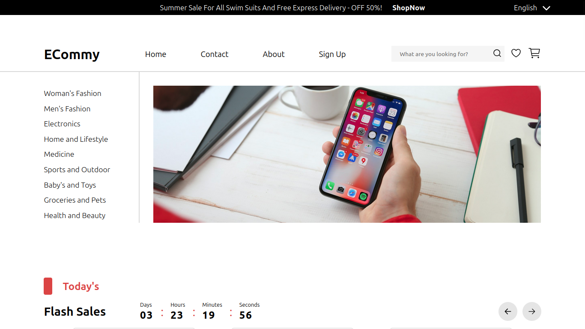

# E-Commerce Web Application

An e-commerce developed with HTML, CSS and ReactJS; based on a [Figma Template](<https://www.figma.com/design/emo2Mu1N5NZYEVwCwubGSM/Full-E-Commerce-Website-UI-UX-Design-(Community)?node-id=1-3&node-type=canvas&t=fOHp1ZuXw6KIOH7V-0>).

## Screenshots



## Run Locally

Clone the project

```bash
  git clone https://github.com/AgusT613/ecommerce-react
```

Go to the project directory

```bash
  cd ecommerce-react
```

Install dependencies

```bash
  npm install
```

If you use nvm (Node Version Manager)

```bash
  nvm install <node-version>
  nvm use <node-version>

  npm install
```

Start the server

```bash
  npm run dev
```
